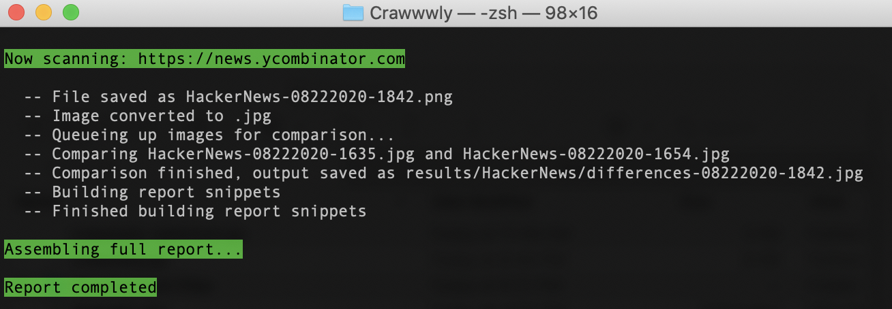

# Crawwwly - Visual Monitoring & Logging


Example report: https://sharedphysics.github.io/Crawwwly/

This script is designed to help with visually-driven comparative monitoring. Crawwwly will go to a site, take a full screenshot, and compare that against the last screenshot captured to identify differences.

## How it works

Crawwwly goes through a multi-step process to capture, analyze, and report on data:

1. It parses a `.CSV` file to create a list of domains to scan
2. For each domain, a directory is created to begin capturing images for analysis
3. `Selenium` + `Firefox` open the site and capture a full-page screenshot
4. That image is compared against the previously captured image, as sorted by name (which means that if you're running Crawwwly multiple times a day, it may not compare correct images). If you're scanning a domain for the first time, the image is compared against itself. This is done through `Pillow`
5. An html snippet is generated for displaying the comparisons
6. Once all of the domains have been scanned, a full report is assembled into a single page from all of the snippets
7. The report is auto-opened for reading pleasure



---

# Running Crawwwly for the first time

## How to Use It
Crawly requires `FireFox`, `Python3`, `Selenium`, and `Pillow`. All of these (except Firefox) can be downloaded and configured from the `requirements.txt` file.

### Installation

Assuming you have Python3 already installed and running:

1. Download the GitHub .zip package and open it in a local folder. 

2. Install `GeckoDriver`. This will be the driver to run a headless firefox browser on. The code here is designed to run with Firefox, and the driver I used is included. But you're welcome to install the latest package from here: https://github.com/mozilla/geckodriver/releases (make sure to choose the correct OS version). Once you download the drive, extract it and copy it to your `bin` folder by running the following terminal script in the directory you saved the download in. Make sure to switch in the correct distro file in your execution.

```
tar -xvf geckodriver-v0.27.0-macos.tar.gz
mv geckodriver /usr/local/bin/
``` 

3. You'll also need to make sure FireFox is installed and that you've [allowed permissions](https://support.apple.com/en-us/HT202491) for the GeckoDriver to run.  

3. Install the requirements.txt file by going to your Crawwwly folder and running `pip3 install -r requirements.txt`

## Running Crawwwly

Running Crawwwwly is really easy:

1. Modify the `domains.csv` file, adding the full URLs that you want to monitor in column 1, and the appropriate "simple name" (no punctuation or spaces) in column 2. This will be used to set the web paths for scanning and then how those images and directories will be created.
2. In your terminal, enter the directory where Crawwwly was saved
3. Run the script as `python3 crawwwwly.py` 

After that, you can run just keep running the script as `python3 crawwwwly.py`

## Setting a CRON

The real value of this script is to set up once and have it running on a schedule. If you're running Crawwwly locally, you can refer to: https://medium.com/better-programming/https-medium-com-ratik96-scheduling-jobs-with-crontab-on-macos-add5a8b26c30 otherwise, you'll need to refer to your server/hosting to figure out their cron-scheduling solution. 

I recommend running the script weekly for best results, but no more than daily.

Note, if you're running Crawwwly on a cron, you may want to comment out line 197 (opening the report on completion): `webbrowser.open('file://' + os.path.realpath("Report.html"))` 

---

# Development

## Log

* 2020 09 25 - Fixed readme.md instructions
* Known bug: missing body element on some sites
``` selenium.common.exceptions.JavascriptException: Message: TypeError: document.body is null ```

### V2
- Parse filenames to ensure correct last 2 images are being compared
- Capture difference as % for plotting
- Figuring out if we can bypass png->jpg conversion to avoid the alpha channel (transparency) issue
- Add a plot chart
- Terminal alert (email?) - % differences between two images, flagging above x%
- Refactoring for optimization: making all of the similar steps run together (i.e., to not open/close firefox and selenium for each site)

### General to do...
- Logo
- Hosted version for SaaS

### Testing and Contributing
Please note, the `development files` folder includes the entirety of the app broken into individual components for running and refining the process. 
